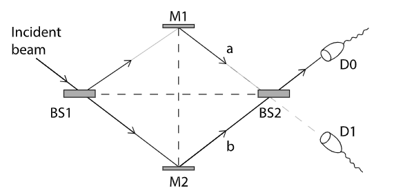

This article is inspired from MIT professor Barton Zwiebach`s online courses. If it has been long time since you left college, don`t worry! This article is a short  overview of the key characteristics of Quantum Mechanics which will be helpful in Quantum physics and Quantum Information Science. Prof. Barton caught my attention as soon as I hit play button, he goes, Quantum mechanics is a framework; Wrap it around something it becomes quantum-something. For example, quantum mechanics applied to physical phenomena gives Quantum physics and similarly quantum mechanics applied to photons (in regular english when applied to light and optical devices) turns into quantum optics and so on. Although there is a lot of research going on at the moment, the era of quantum physics began in 1925 with the discoveries of Schrodinger and Heisenberg, while the seeds for these discoveries were planted by Planck, Einstein, Bohr, de Broglie, and others. This field is counterintuitive and it might seem paradoxical and let`s see why.

Lets understand the following key features of Quantum Mechanics:
### Property of Linearity;

&nbsp;&nbsp;&nbsp;&nbsp;&nbsp;&nbsp;&nbsp;&nbsp;&nbsp;&nbsp;&nbsp;&nbsp;Quantum mechanics shares the property of linearity with electromagnetic theory which helps us understand the theory of quantum mechanics. It  could  be argued, quantum mechanics is  simpler  than  classical mechanics. A theory is a set of equations with variables for which we have to find solutions for. There are linear and nonlinear theories of which non linear theories are complicated than linear theories. In a linear theory, we can add two solutions to obtain a third solution, marvelous right. Maxwell`s theory of electromagnetism is an example, where a solution can be described as an electromagnetic wave propagating in a direction. Another solution is an electromagnetic wave propagating in another direction. Sum of these two waves is also a solution. Which is true, as we see it in real life from cell phones, TVs and radios. The air around you is full of electromagnetic waves, each one propagating oblivious to the other ones. I can`t imagine my information being transmitted to a wrong recipient :) Let`s look at this in action;

A solution of Maxwell's equation is described by an electric field $ E$, a magnetic field $ B$, a charge density $ \rho$ and a current density $J$, all collectively denoted as $ (E; B; \rho; J)$. Linearity implies if $ (E; B; \rho; J)$ is a solution, so is $ (\alpha E; \alpha B; \alpha \rho; \alpha J)$. Likewise, given two solutions $ ( E_1; B_1; \rho_1; J_1)$ and $ ( E_2; B_2; \rho_2; J_2)$, we can obtain a new solution by adding them resulting in, $$ ( E_1 + E_2; B_1 + B_2; \rho_1 + \rho_2; J_1 + J_2)$$ We will consider equations for which the solutions satisfy the following conditions:  $(i)$ given a solution, any multiple of the solution is also a solution and, $(ii)$ given two solutions the sum of solutions is also a solution.  We will call these linear equations, and they take the general form $$ Lu=0$$ where u denotes the unknown variable. The unknown may be a number, a function of  time,  a function of space, a function of spacetime, essentially anything unknown!  In fact, $ u$ could represent a collection $(u1;u2;:::)$ of unknowns.  The symbol $ L$ denotes a linear operator, an object that acts on $ u$ and satises the following two properties: $$ L(\alpha u)=\alpha L u,$$ $$ L(u_1 + u_2)=L u_1 + L u_2$$ Now, bear this property in mind, the equation will be introduced in a minute.

### Complex Numbers;

&nbsp;&nbsp;&nbsp;&nbsp;&nbsp;&nbsp;&nbsp;&nbsp;&nbsp;&nbsp;&nbsp;&nbsp;The signature equation in this theory is the Schrodinger equation which is a linear equation for a quantity called the wave function and it determines its time evolution.Max Born, who months later after writing this equation, suggested that the wavefunction encodes probabilities. The Schrodinger equation is a partial differential equation that takes the form $$ i\hbar \frac{\partial\Psi}{\partial t} = \hat{\mathcal{H}} \Psi $$ where $ i$ is the imaginary unit $ (i=\sqrt{-1})$, $ \hbar$ is Planck's constant, and $ \hat{\mathcal{H}}$ is the Hamiltonian or energy  operator.  The wavefunction is  a complex  number. The Hamiltonian $ \hat{\mathcal{H}}$ is a linear operator that can act on wavefunctions: $ \hat{\mathcal{H}}(\alpha \Psi) = \alpha \hat{\mathcal{H}} \Psi$ and $ \hat{\mathcal{H}}(\Psi_1 + \Psi_2) = \hat{\mathcal{H}}(\Psi_1) + \hat{\mathcal{H}}(\Psi_2)$, where $ \alpha$ is a complex constant. $$ L\Psi=i\hbar \frac{\partial\Psi}{\partial t} - \hat{\mathcal{H}} \Psi=0$$ for the Schrodinger equation to be linear. It is now easy to verify that L is a linear operator. In quantum mechanics, complex numbers are fundamental. Since complex numbers cannot be directly measured the relation between the wavefunction and a measurable quantity must be somewhat indirect. So, Max Born's idea to identify probabilities, which are always positive real numbers, with the square of the norm of the wavefuntion $ |\Psi|^2$ was the idea. The mathematical framework required to express the laws of quantum mechanics consists of complex numbers. The wavefunction $\Psi$ is a vector in a complex vector space. Moving on; So far so good, now let`s dive into those counterintuitive characteristics;

### Loss of Determinism;

&nbsp;&nbsp;&nbsp;&nbsp;&nbsp;&nbsp;&nbsp;&nbsp;&nbsp;&nbsp;&nbsp;&nbsp;Einstein presented the idea that light is made up of quanta of light called photon. Unlike Newton`s particle in which an object of size zero at a position carrying some velocity and maxwell`s equations were successfull in these, quantum mechanical idea of particle is that it is an indivisible amount of energy. Photon carries little energy and you know what is a good detector of photons? Eye! In a totally dark room it can detect as low as five photons  when they hit the retina. Let`s do an experiment; consider a polarizer, a sheet of plastic or some kind of material which polarizes light. Watch a khan academy video on linear and circular polarization of light to understand polarizer, applications of this are in polarized glasses & 3D glasses. Basically, it allows light in one polarization and the other does not go through the polarizer, simple. Let`s consider a beam of light hitting the polarizer at an angle $\alpha$, the energy of the beam is represented as, $$E_\alpha = E_0 \cos \alpha \hat{x} + E_0 \sin \alpha \hat{y} ,$$ $E_0$ is the energy before hitting polarizer, $\hat{x}$ & $\hat{y}$ are the horizontal and vertical axes and consider the polarizer horizontally polarized along $\hat{x}$. After passing through the polarizer, $$E = E_0 \cos \alpha \hat{x}$$
In classical physics, usual behavior is that the fraction of energy through is $(\cos \alpha)^2$. Here all the photons are identical, from the experiment, some are absorbed and some are reflected. But if the photons are identical, all of them must be absorbed or reflected. Trouble to photons & Einstein is awaiting on the corner from Classical physics. 
Speculations are made, like photons are identical but polarizer has substructure, which when interacts with interatomic parts in an angle it goes through and in other angle, it does not. Many experiments are done and it is proven wrong. So, Einstein proposed another theory saying the photon has hidden variables which we don`t know and we need to find it out. Quantum theory is not yet complete. 
A gentleman named John Bell with bell inequalities proved that quantum mechanics cannot be made deterministic with hidden variables, which is proven by experiments. So, they settled it this way, end of the day we can only predict probabilities that photon gets through or not. Now, what is the wavefunction of a photon in quantum world? Dirac puts forward a notation to describe photon polarized in a direction x, $|photon; x\rangle$, which is the state of that photon. Similarly, $|photon; y\rangle$, for a photon in y direction. There can exist a state,
$$\cos \alpha |photon; x\rangle + \sin \alpha |photon; y\rangle = |photon; \alpha \rangle ,$$ which is superposition of one state on to other. Comparing this equation to classical equation, $E$ is removed because the above equation is for a single photon. After passing through the polarizer, state is $|photon; x \rangle$, because photon is hitting an x direction polarizer and $\cos \alpha$ is not needed because, the whole photon goes though and not a fraction of photon. We will see it in more detail;

### Quantum Superpositions;

&nbsp;&nbsp;&nbsp;&nbsp;&nbsp;&nbsp;&nbsp;&nbsp;&nbsp;&nbsp;&nbsp;&nbsp;In classical physics, sum of electric fields is an electric field, nothing strange. How is it different in quantum physics? One way to illustrate it is using Mach-Zehnder interferometer in the figure below.

The setup consists of two Beam Splitters BS1 and BS2, two mirrors M1 and M2, and two detectors D0 and D1. Consider the configuration is prepared to produce an interference so that all the photons end up at D0. This experiment is done with a beam of light before photon theory. You might think interference is one photon interfering with other resulting in cancelling/destructive interference in which bunch of energy is going into nothing which is not possible. On the other hand if it is constructive interference, two photons become four in which energy is not conserved. So, in quantum theory light interference, each photon interferes with itself, this is the only possibility. It can be framed this way, state of each photon = superposition of state of photon in upper beam + lower beam. 
Let`s consider two states, $|A\rangle$ and $|B\rangle$. If we measure some property (position, momentum, spin or energy), on $|A\rangle$ you get $a$ and on $|B\rangle$ you get $b$. Now in a quantum mechanical state, $\alpha |A\rangle + \beta |B\rangle$. Measure the same property on this state, you always get either a or b (not an average) with different probabilities.
$$Prob(a)=\frac{|\alpha|^2}{|\alpha|^2 + |\beta|^2},$$ $$Prob(b)=\frac{|\beta|^2}{|\alpha|^2 + |\beta|^2},$$
When you want to figure out what state you have, you have to prepare many copies of your state in this quantum system and do the experiment many times, because sometimes you`ll get $A$ and sometimes $B$. After you have measured many times, you can assess the probabilities and reconstruct the state.

### Entanglement;

&nbsp;&nbsp;&nbsp;&nbsp;&nbsp;&nbsp;&nbsp;&nbsp;&nbsp;&nbsp;&nbsp;&nbsp;Quantum Mechanical Entanglement is the phenomenon of superposition of states of two particles. We dont need strong interaction between particles to produce entanglement, they can be non-interacting. We have a particle 1 which can be in any of the states $|u_1\rangle, |u_2\rangle$ and particle 2 in any of the states $|v_1\rangle, |v_2\rangle$. The state of the system can be described as $|u\rangle \times |v\rangle$. Consider,
$$(\alpha_1 |A_1\rangle + \alpha_2 |A_2\rangle) \times (\beta_1 |B_1\rangle + \beta_2 |B_2\rangle) =$$ $$\alpha_1 \beta_1 |A_1\rangle \times |B_1\rangle + \alpha_1 \beta_2 |A_1\rangle \times |B_2\rangle +
$$ $$\alpha_2 \beta_1 |A_2\rangle \times |B_1\rangle +
\alpha_2 \beta_2 |A_2\rangle \times |B_2\rangle$$
A state of two particles is said to be entangled if it cannot be written in the factorized form $(....) \times (....)$ which allows us to describe the state by simply stating the state of each particle.

